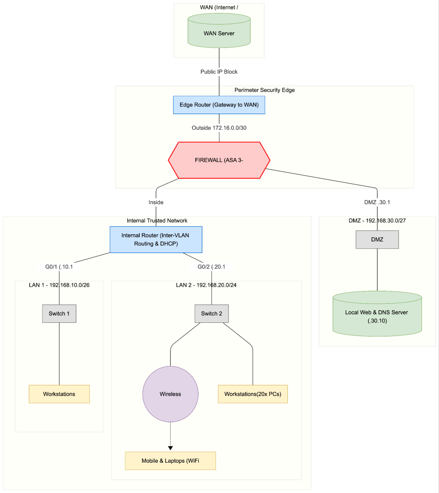
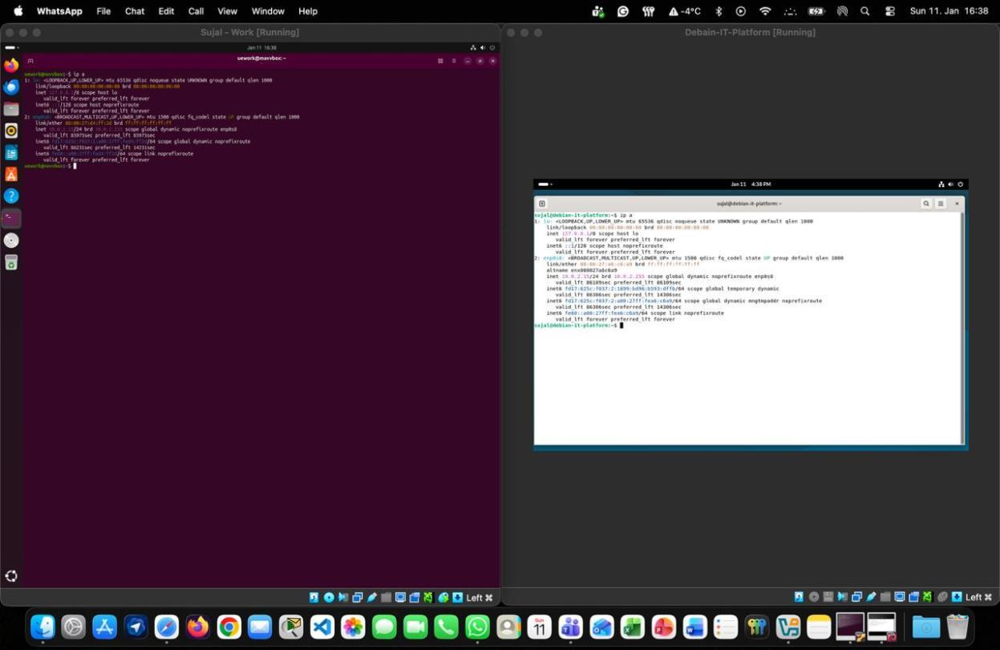
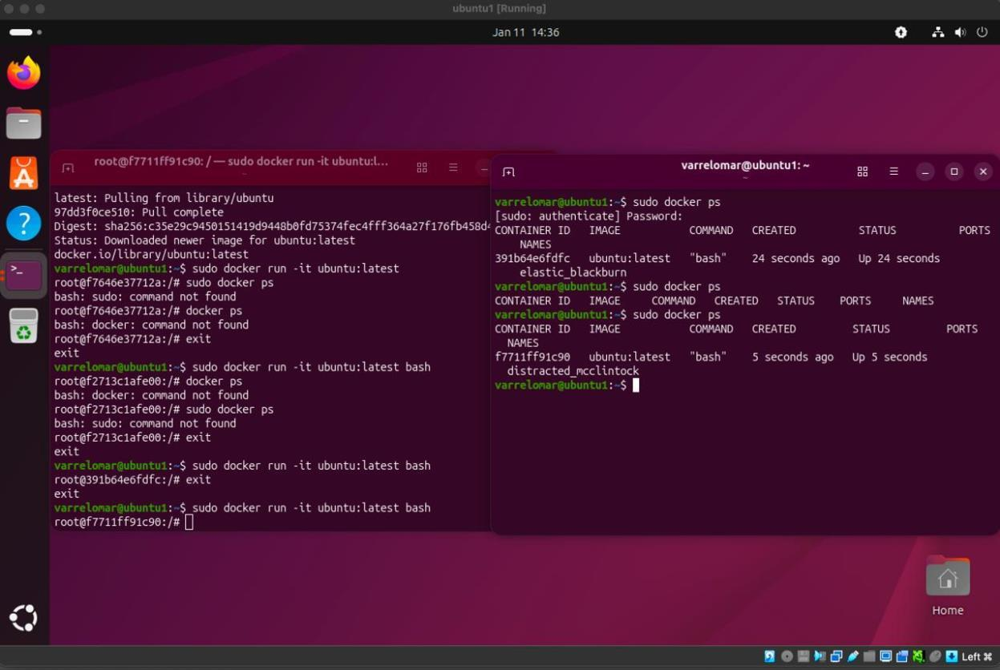
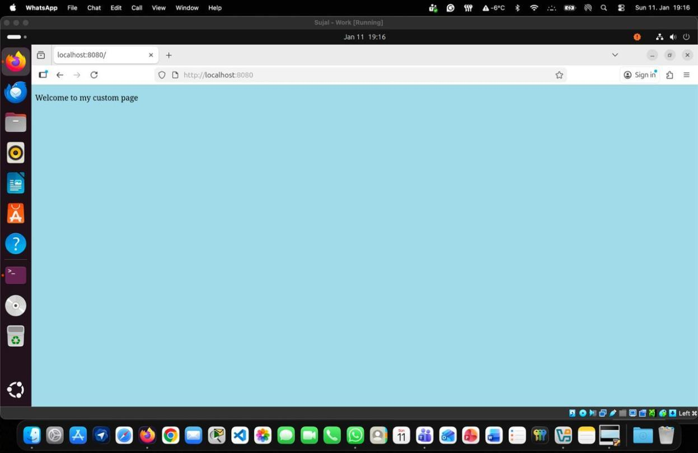

<div align="center">

# 🖥️ VMS-Docker-Network

### Enterprise Network Design · Linux Virtualization · Docker Containerization


**IT Platform — Final Project · Winter 2025/2026**
UE University of Europe for Applied Sciences · Group 9

</div>

---

A hands-on **systems & networking** project covering the core building blocks of IT
infrastructure end to end: designing a secure, segmented **enterprise network**,
running multiple **Linux operating systems** as virtual machines, and packaging &
deploying applications with **Docker** — from a single-script container to a
configurable Flask web service.

## ✨ What this project demonstrates

| Area | Skills |
| ---- | ------ |
| 🌐 **Networking** | Hierarchical network design, VLSM subnetting, static routing, DMZ, three-legged firewall, DHCP & DNS, connectivity testing |
| 🐧 **Linux & virtualization** | Oracle VirtualBox, Ubuntu & Debian, user & sudo management, CLI administration, Synaptic package management |
| 🐳 **Containerization** | Docker images & containers, Docker Hub, Dockerfiles, port mapping, runtime configuration via environment variables |
| 🐍 **Development** | Python 3, Flask, Jinja2 templating |

---

## 🗺️ Task 1 — Enterprise network design (Cisco Packet Tracer)

A hierarchical topology (access / distribution / edge) segmented into three security
zones, with a perimeter **ASA firewall** in a three-legged configuration controlling
all cross-zone traffic.

<div align="center">
  
</div>

| Zone | Network | Trust | Hosts |
| ---- | ------- | ----- | ----- |
| 🟢 Internal LAN 1 | `192.168.10.0/24` | Trusted (SL 100) | 20 workstations |
| 🔵 Internal LAN 2 | `192.168.20.0/26` | Trusted (SL 100) | Laptops + mobile via Wi-Fi (WAP) |
| 🟠 DMZ | `192.168.30.0/27` | Semi-trusted (SL 50) | Public Web + DNS server (`hellofromnoel.de`) |
| 🔴 WAN | `8.8.8.0/24` | Untrusted (SL 0) | Simulated internet |

Backbone links use `/30` point-to-point subnets; the firewall serves DHCP and enforces
zone-to-zone policy (e.g. WAN→LAN denied, LAN→WAN permitted, DMZ→LAN denied).
📄 Full design, addressing table & test matrix: [`report/Group9-Cisco-Network-Report.pdf`](report/Group9-Cisco-Network-Report.pdf)
📦 Open the live simulation: [`task1-network-firewall/Network.pkt`](task1-network-firewall/Network.pkt)

---

## 🐧 Task 2 — Linux virtual machines

**Ubuntu** and **Debian** created in Oracle VirtualBox and run **simultaneously**.
Includes admin + normal user creation, sudo configuration, Python installation and
execution from the terminal, and software installation via the Synaptic Package Manager.

<div align="center">
  
</div>

---

## 🐳 Task 3 — Docker on Ubuntu

Docker installed on the Ubuntu VM, authenticated with Docker Hub, then used to run the
`hello-world` and `ubuntu` images, list containers, and create a **custom command**
inside a running container.

<div align="center">
  
</div>

---

## 🧩 Task 4 — Python container

A minimal Python program packaged into its own Docker image.

```bash
cd task4-python-container
docker build -t hello-python .
docker run --rm hello-python
```

---

## 🌶️ Task 5 — Flask container (runtime-configurable)

A Flask web app whose page background colour is injected **at runtime** through the
`MY_COLOR` environment variable — demonstrating container configuration without
rebuilding the image.

```bash
cd task5-flask-container
docker build -t flask-app .
docker run --rm -p 8080:8080 -e MY_COLOR=lightblue flask-app
# open http://localhost:8080
```

<div align="center">
  
</div>

---

## 📁 Repository structure

```
VMS-Docker-Network/
├── task1-network-firewall/    # Cisco Packet Tracer simulation (Network.pkt)
├── task2-linux-vms/           # Python program run on the Ubuntu VM
├── task4-python-container/     # hello.py + Dockerfile
├── task5-flask-container/      # Flask app, Dockerfile, requirements.txt, templates/
├── report/                    # Full written reports (PDF)
├── presentation/              # Slide deck (PPTX)
└── docs/screenshots/          # Evidence images used in this README
```

## 🛠️ Tech stack

`Cisco Packet Tracer` · `Oracle VirtualBox` · `Ubuntu` · `Debian` · `Docker` ·
`Docker Hub` · `Python 3.11` · `Flask` · `Jinja2`

## 👥 Group 9

Alma Nyarko · David Kioko · Segun Abraham Oladimeji · Sujal Choudhary ·
Shat Chakra Pawar (Amgothu) · Noël Sigmunczyk · Varrel Omar Farazi

## 📄 License

Released under the [MIT License](LICENSE).
